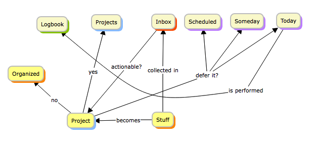

```
Roberto Nogueira  
BSd EE, MSd CE
Solution Integrator Experienced - Certified by Ericsson
```
# Project Site Manager


**About**

This is in order to help the working CLI daily activities. It implements the [Getting Things Done(GTD)](https://www.amazon.com/gp/product/B000WH7PKY) process flow in the underlying file system.


**Advantages:**

* [Getting Things Done(GTD)](https://www.amazon.com/gp/product/B000WH7PKY) Development Flux and Environment seamlessly integrated.
* Supports for OSX and Linux.
* Object-Oriented bash style
* Supports [**todo.txt-cli**](https://github.com/todotxt/todo.txt-cli).

See example of use below:

```shell
$ today
:
~/Today $
```



## Requirements and Tips

In order to install `Today Manager`, it is required that the following has been installed already:

* [git](https://git-scm.com/book/en/v2/Getting-Started-Installing-Git)

**For further help:**

```shell
Crafted (c) 2022 by Daitanlabs - We are stronger together 
Today v1.0.0

today [today    [end|help|methods|print|start|version]]
::
homepage http://bitbucket.wrs.com/users/rmartins/repos/project-today-manager
```

**Changes log**

* **1.0.0** Initial version.

**Refs:
* **[Todo.txt](http://todotxt.org)** - A simple and extensible shell script for managing your todo.txt file.

