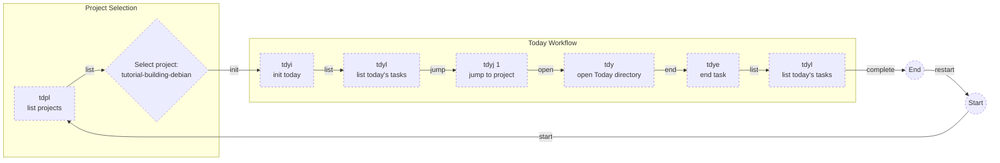

# Project Today Manager


**About**

This is in order to help the working CLI daily activities. It implements the github process workflow in the underlying file system.


**Advantages:**

* []() Development Flux and Environment seamlessly integrated.
* Supports for Mac).
* Object-Oriented bash style

See example of use below:

```shell
$ tdpl
:
tutorial-building-debian

$ tdyi tutorial-building-debian
$ tdyl
:
1 2022-01-07 tutorial-building-debian
2 2022-01-07 project-puppet-postgresql-upgrade

$ tdyj 1
:
tutorial-building-debian $ tdy

Today $ tdye tutorial-building-debian
Today $ tdyl
:
2 2022-01-07 project-puppet-postgresql-upgrade

Today $ tdyl
:
2022-01-09_2329-tutorial-building-debian
```




**Requirements and Tips**

In order to install `Today Manager`, it is required that the following has been installed already:

* [tree](https://oldmanprogrammer.net/source.php?dir=projects/tree) for installing do `brew install tree`.
* [tag](https://github.com/jdberry/tag) for installing do `brew install tag`.

**For further help:**

```shell
Crafted (c) 2025 by Zoatworks - We are stronger together 
Today v1.0.2

today [archive|end|help|init|list|setup|version]
      [projects [help|list|new]]
      [scheduled [archive|end|help|init|list|today]]

aliases
  alias tdp='_projects'
  alias tdpl='_projects.list'
  alias tdpn='_projects.new'
  alias tds='_scheduled'
  alias tdsa='_scheduled.archive'
  alias tdse='_scheduled.end'
  alias tdsi='_scheduled.init'
  alias tdsj='_scheduled.jump'
  alias tdsl='_scheduled.list'
  alias tdst='_scheduled.today'
  alias tdy='today'
  alias tdya='today.archive'
  alias tdye='today.end'
  alias tdyea='today.end.all'
  alias tdyi='today.init'
  alias tdyj='today.jump'
  alias tdyl='today.list'      

homepage https://github.com/enogrob/project-today-manager
```
**Installation**

```shell
pushd /tmp
git clone git@github.com:enogrob/project-today-manager.git
source ./project-today-manager/today
mv project-today-manager ~/Projects
echo "test -f ~/Projects/project-today-manager/today && source ~/Projects/project-today-manager/today" >> ~/.zshrc
source ~/.zshrc
popd
```

**Changes log**

* **1.0.0** Initial version.
* **1.0.1** `_projects.new` is working as expected.
* **1.0.2** `today.archive` corrected and `today.end.all` designed.

**Refs:**
* **[]()**

