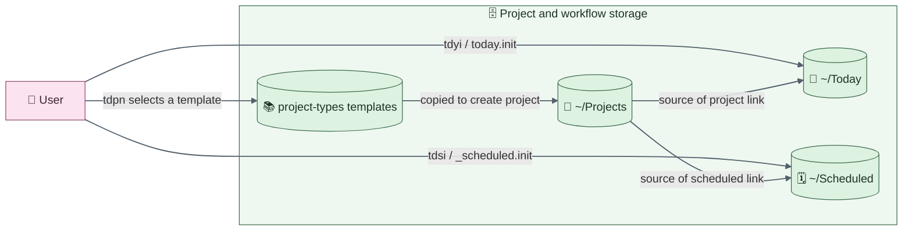
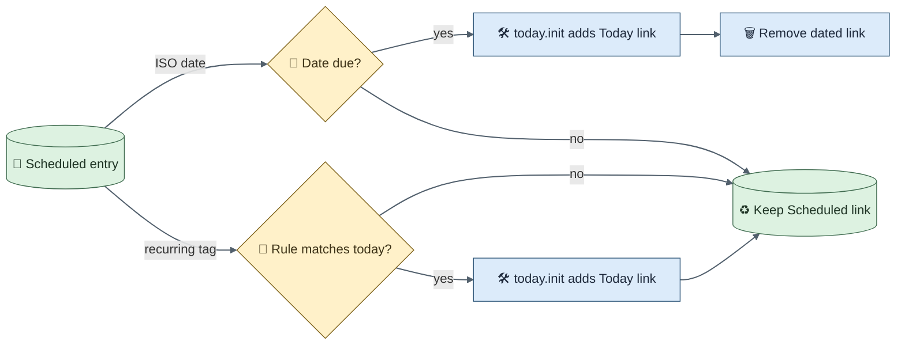

# Zsh Today Manager

A file-system-based workflow for managing projects, today's focus, and scheduled work. The implementation and project templates are in [`src/zsh-today-manager`](src/zsh-today-manager).

## Contents

- [Implementations](#implementations)
- [Workflow](#workflow)
- [Getting Started](#getting-started)
- [Commands](#commands)
- [Testing](#testing)
- [References](#references)

The manager represents Today and Scheduled entries as symbolic links to project directories. Link names include a position and date or schedule tag, so the workflow can be inspected with ordinary file-system tools.

## Implementations

- [`today.zsh`](src/zsh-today-manager/today.zsh) is the legacy Zsh implementation and the target of the default `today` symlink. Sourcing it runs `today.setup` and defines the functions and aliases.
- [`today-next.zsh`](src/zsh-today-manager/today-next.zsh) is an experimental Zsh dispatch and reflection layer. It sources `today`, then enables commands such as `today projects list`, `today scheduled list`, and `today methods`.
- [`today.sh`](src/zsh-today-manager/today.sh) is a separate Bash implementation. It requires Bash 4 or later and GNU `date -d`; the Bash 3.2 and BSD `date` included with macOS do not meet those requirements.

The Zsh scheduler uses the macOS/BSD `date -j -f` interface. The scripts initialize `~/Today`, `~/Projects`, and `~/Scheduled`. Project templates are read from `~/Projects/zsh-today-manager/project-types`, so the source directory must be available at that path (or through a symlink there). The legacy Zsh implementation also supports projects under `~/Apps` for Today entries.

## Workflow

Creating a project copies a selected template into `~/Projects`. Initializing Today or Scheduled creates a symlink to an existing project; ending an entry removes the symlink rather than deleting the project.


```mermaid
flowchart LR
  user["👤 User"]

  subgraph storage["🗄️ Project and workflow storage"]
    templates[("📚 project-types templates")]
    projects[("📁 ~/Projects")]
    today[("📅 ~/Today")]
    scheduled[("🗓️ ~/Scheduled")]
  end

  user -->|tdpn selects a template| templates
  templates -->|copied to create project| projects
  user -->|tdyi / today.init| today
  projects -->|source of project link| today
  user -->|tdsi / _scheduled.init| scheduled
  projects -->|source of scheduled link| scheduled

  classDef actor fill:#FBE4F0,stroke:#8E496D,color:#3F2434;
  classDef data fill:#DDF2E1,stroke:#3F6B4F,color:#1E3324;
  class user actor;
  class templates,projects,today,scheduled data;
  style storage fill:#EEF8F0,stroke:#3F6B4F,color:#1E3324;
  linkStyle default stroke:#52606D,stroke-width:1.5px;
```

Scheduled tags can be an ISO date (`YYYY-MM-DD`), `daily`, `weekday`, `weekend`, or comma-separated weekday abbreviations (`mon` through `sun`). Dates before today and invalid tags are rejected. Processing a due date creates a Today entry and removes its Scheduled link; matching recurring rules create a Today entry while remaining scheduled.


```mermaid
flowchart LR
  entry[("🔗 Scheduled entry")]
  dueDate{"📅 Date due?"}
  recurrenceMatch{"🔁 Rule matches today?"}
  activateDate["🛠️ today.init adds Today link"]
  removeDate["🗑️ Remove dated link"]
  activateRecurring["🛠️ today.init adds Today link"]
  keepScheduled[("♻️ Keep Scheduled link")]

  entry -->|ISO date| dueDate
  entry -->|recurring tag| recurrenceMatch
  dueDate -->|yes| activateDate
  dueDate -->|no| keepScheduled
  activateDate --> removeDate
  recurrenceMatch -->|yes| activateRecurring
  recurrenceMatch -->|no| keepScheduled
  activateRecurring --> keepScheduled

  classDef process fill:#DCEBFA,stroke:#355C7D,color:#1E293B;
  classDef data fill:#DDF2E1,stroke:#3F6B4F,color:#1E3324;
  classDef decision fill:#FFF1C9,stroke:#80641D,color:#3D3217;
  class activateDate,removeDate,activateRecurring process;
  class entry,keepScheduled data;
  class dueDate,recurrenceMatch decision;
  linkStyle default stroke:#52606D,stroke-width:1.5px;
```

`today.init` avoids adding a duplicate Today link for a project already listed there. The `tdyia` alias runs schedule processing silently; `tdyl` lists Today entries.

## Getting Started

The setup expects the checkout at `~/Projects/zsh-today-manager`. From the repository root, link the implementation there and source its entry point from Zsh:

```shell
mkdir -p "$HOME/Projects"
ln -s "$PWD/src/zsh-today-manager" "$HOME/Projects/zsh-today-manager"
echo 'test -f "$HOME/Projects/zsh-today-manager/today" && source "$HOME/Projects/zsh-today-manager/today"' >> "$HOME/.zshrc"
source "$HOME/.zshrc"
today --help
```

The `today` entry point is a symbolic link to `today.zsh`. The setup creates the Today, Projects, and Scheduled directories if they do not exist.

To try the experimental dispatcher instead, source `today-next.zsh` from Zsh:

```shell
source "$HOME/Projects/zsh-today-manager/today-next.zsh"
today projects list
today scheduled list
```

## Commands

The Zsh aliases provide the short workflow commands:

| Alias | Action |
| --- | --- |
| `tdpn NAME [TYPE]` | Create a project from `project-types/TYPE` (`project` by default). |
| `tdyi NAME` | Add a project to Today. |
| `tdyj POSITION_OR_NAME` | Enter a Today project. |
| `tdye NAME` | Remove a project from Today. |
| `tdyl` | List Today entries. |
| `tdya` | Renumber/archive Today entries, then list them. |
| `tdsi NAME [TAG]` | Schedule a project; the default tag is today's date. |
| `tdsl` | List Scheduled entries. |
| `tdyia` | Process Scheduled entries for today. |

The experimental overlay exposes the same namespaces as subcommands, for example `today projects new NAME TYPE` and `today scheduled init NAME TAG`. Alias `tdpl` points to project listing in the overlay, but the legacy implementation reassigns it to app listing; use the overlay when relying on the subcommand interface.

## Testing

Run the isolated Zsh smoke test from the implementation directory:

```shell
cd src/zsh-today-manager
zsh tests/test-today-next.zsh
```

The test covers dispatch/reflection, default directories, aliases, and the daily recurring schedule path. Other date and recurrence branches are implemented but are not covered by this smoke test.

## References

- [Legacy Zsh implementation](src/zsh-today-manager/today.zsh)
- [Experimental Zsh dispatcher](src/zsh-today-manager/today-next.zsh)
- [Bash implementation](src/zsh-today-manager/today.sh)
- [Project templates](src/zsh-today-manager/project-types/)
- [Zsh smoke test](src/zsh-today-manager/tests/test-today-next.zsh)
- [Bash conversion notes](src/zsh-today-manager/BASH_CONVERSION_NOTES.md)
- [Zsh documentation](https://zsh.sourceforge.io/Doc/)
- [Bash reference manual](https://www.gnu.org/software/bash/manual/)
- [GNU Coreutils date invocation](https://www.gnu.org/software/coreutils/manual/html_node/date-invocation.html)

