```mermaid
stateDiagram-v2
  [*] --> ProjectCreation: "✨ User wants new project"
  ProjectCreation --> ProjectExists: "🆕 tdpn project_name type"
  ProjectExists --> SchedulingDecision: "🔀 Project ready"
  SchedulingDecision --> ImmediateWork: "🚀 Work now"
  SchedulingDecision --> FutureScheduling: "⏳ Schedule for later"
  ImmediateWork --> TodayActive: "🌞 tdyi project_name"
  FutureScheduling --> DateScheduled: "📆 tdsi project_name YYYY-MM-DD"
  FutureScheduling --> RecurringScheduled: "🔁 tdsi project_name daily/weekday/weekend"
  FutureScheduling --> DayScheduled: "📅 tdsi project_name mon,tue,fri"
  DateScheduled --> ScheduledList: "⏱️ Waiting"
  RecurringScheduled --> ScheduledList: "⏱️ Waiting"
  DayScheduled --> ScheduledList: "⏱️ Waiting"
  ScheduledList --> TodayActive: "🤖 tdyia (auto-migration)"
  TodayActive --> WorkInProgress: "🚀 tdyj N (jump to project)"
  WorkInProgress --> TodayActive: "🔄 Continue working"
  WorkInProgress --> Completed: "✅ tdye project_name"
  Completed --> Archived: "📦 tdya (archive)"
  Archived --> [*]: "🏁 Day complete"
  TodayActive --> Archived: "🌙 End of day"
  ScheduledList --> ScheduledList: "🔁 Recurring items remain"
  DateScheduled --> [*]: "🗑️ Date-based items auto-removed"
```

# **Project Today Manager**

[Homepage](https://github.com/enogrob/zsh-today-manager)


## Contents

- [Summary](#summary)
- [Architecture](#architecture)
  - [Alternative Perspectives](#alternative-perspectives)
  - [Key Concepts](#key-concepts)
- [Tech Stack](#tech-stack)
- [Getting Started](#getting-started)
- [Usage Examples](#usage-examples)
- [Contributing Guidelines](#contributing-guidelines)
- [License](#license)
- [References](#references)

### Summary

The Zsh Today Manager is a comprehensive CLI tool designed to implement a Getting Things Done (GTD) workflow using the file system as the foundation. This project provides a sophisticated task and project management system that seamlessly integrates with the Zsh shell environment. The system transforms traditional project management into an elegant file-system-based workflow that promotes transparency, portability, and developer-friendly operations.

The core strength of this system lies in its three-component architecture: **Projects** for managing your project portfolio, **Scheduled** for flexible time-based project scheduling, and **Today** for managing current active tasks. The tool supports multiple scheduling patterns including ISO dates (YYYY-MM-DD), recurring schedules (daily, weekday, weekend), and specific day abbreviations, making it highly adaptable to different workflow patterns. The automatic processing of scheduled items ensures that your daily workflow stays current without manual intervention.

What makes this project particularly compelling is its object-oriented bash approach combined with a development environment that seamlessly integrates with macOS workflows. The file system implementation provides complete transparency into your project state while maintaining the flexibility to work with existing development tools and practices. This makes it an ideal solution for developers who want a lightweight, scriptable project management system that doesn't impose heavy GUI overhead or complex dependencies.

### Architecture

```mermaid
%% Pastel colors and emoticons for clarity and friendliness
graph TD
  A["🧑‍💻 User Input"] --> B{"🧩 Command Parser"}
  B -->|"📁 projects"| C["📂 Projects Module"]
  B -->|"⏰ scheduled"| D["🗓️ Scheduled Module"]
  B -->|"📅 today"| E["🌞 Today Module"]
  B -->|"❓ help/version"| F["🛠️ Core Functions"]

  subgraph "File System Layer 🗄️"
    G["📁 ~/Projects"]
    H["📅 ~/Scheduled"]
    I["🌞 ~/Today"]
    J["🧩 Project Templates"]
  end

  subgraph "Projects Management 🗂️"
    C --> K["🔍 List Projects"]
    C --> L["✨ Create New Project"]
    L --> J
    K --> G
    L --> G
  end

  subgraph "Scheduling System ⏳"
    D --> M["📝 Schedule Item"]
    D --> N["📋 List Scheduled"]
    D --> O["➡️ Process Scheduled → Today"]
    M --> P{"🔎 Validate Schedule Type"}
    P -->|"📆 ISO Date"| Q["📅 Date Validation"]
    P -->|"🔁 Recurring"| R["🔄 Pattern Validation"]
    P -->|"📅 Day Names"| S["🔤 Day Abbreviation Check"]
    Q --> H
    R --> H
    S --> H
    O --> T["🤖 Auto-Migration Logic"]
  end

  subgraph "Today Workflow 🌞"
    E --> U["📋 List Today's Tasks"]
    E --> V["🚀 Jump to Project"]
    E --> W["✅ End Task"]
    E --> X["📦 Archive Today"]
    T --> I
    U --> I
    V --> G
    W --> I
    X --> I
  end

  subgraph "Daily Automation 🔄"
    Y["⏰ Cron/Manual Trigger"]
    Y --> O
    O --> Z{"🗓️ Schedule Type"}
    Z -->|"📆 Date-based"| AA["🗑️ Remove After Date"]
    Z -->|"🔁 Recurring"| BB["♻️ Keep Active"]
    AA --> H
    BB --> H
  end

  %% Pastel color styles
  style G fill:#fce4ec,stroke:#f8bbd0,stroke-width:2px
  style H fill:#e1f5fe,stroke:#b3e5fc,stroke-width:2px
  style I fill:#f3e5f5,stroke:#ce93d8,stroke-width:2px
  style J fill:#fff3e0,stroke:#ffe0b2,stroke-width:2px
  style C fill:#e3f2fd,stroke:#90caf9,stroke-width:2px
  style D fill:#f1f8e9,stroke:#aed581,stroke-width:2px
  style E fill:#fffde7,stroke:#fff59d,stroke-width:2px
  style F fill:#ede7f6,stroke:#b39ddb,stroke-width:2px
```



#### Alternative Perspectives

```mermaid
classDiagram
  class TodayManager {
    <<(🌞,#fce4ec) TodayManager>>
    +String TODAY_VERSION
    +String TODAY_HOME
    +String TODAY_PROJECTS
    +String TODAY_SCHEDULED
    +Array TODAY_PROJECT_TYPES
    +setup()
    +version()
    +help()
  }
  class ProjectsModule {
    <<(📂,#e3f2fd) ProjectsModule>>
    +list(filter)
    +new(name, type)
    +validateType(type)
    +getTemplates()
  }
  class ScheduledModule {
    <<(🗓️,#f1f8e9) ScheduledModule>>
    +init(project, tags)
    +list()
    +archive()
    +end(project)
    +today()
    +validateTags(tags)
    +processRecurring()
  }
  class TodayModule {
    <<(🌞,#fffde7) TodayModule>>
    +init(project)
    +list()
    +jump(identifier)
    +end(project)
    +archive()
    +print()
  }
  class FileSystemInterface {
    <<(🗄️,#ede7f6) FileSystemInterface>>
    +createSymlink(source, target)
    +removeSymlink(path)
    +listDirectory(path)
    +validatePath(path)
  }
  class ScheduleValidator {
    <<(🔎,#fff3e0) ScheduleValidator>>
    +validateISODate(date)
    +validateRecurring(pattern)
    +validateDayAbbrev(days)
    +isFutureDate(date)
  }
  TodayManager "1" --> "1" ProjectsModule
  TodayManager "1" --> "1" ScheduledModule
  TodayManager "1" --> "1" TodayModule
  ProjectsModule --> FileSystemInterface
  ScheduledModule --> FileSystemInterface
  TodayModule --> FileSystemInterface
  ScheduledModule --> ScheduleValidator
  ScheduledModule "1" --> "*" TodayModule : migrates_to
  ProjectsModule "1" --> "*" ScheduledModule : schedules
  ProjectsModule "1" --> "*" TodayModule : activates
```

<details>
<summary><strong>1. Class Diagram - Structural Relationships</strong> (Click to expand)</summary>



</details>

<details>
<summary><strong>2. Journey Process - State Transitions</strong> (Click to expand)</summary>



</details>

<details>
<summary><strong>3. Mind Map - Interconnected Themes</strong> (Click to expand)</summary>



</details>

```mermaid
mindmap
  root((🌞 Zsh Today Manager))
    GTD Philosophy 🧠
      Getting Things Done ✅
      File System Workflow 🗄️
      Transparency 👁️
      Developer Friendly 👨‍💻
    Project Management 🗂️
      Portfolio View 📂
      Template System 🧩
      Type Categorization 🏷️
      Creation Workflow ✨
    Scheduling Intelligence ⏳
      ISO Date Support 📆
      Recurring Patterns 🔁
      Day Abbreviations 📅
      Auto Migration 🤖
      Future Validation 🔮
    Daily Workflow 🌞
      Today's Focus 🎯
      Task Navigation 🚀
      Completion Tracking ✅
      Archive System 📦
    Technical Excellence 🏆
      Zsh Integration 🐚
      Object Oriented Bash 🧑‍💻
      Symbolic Links 🔗
      Directory Structure 🗂️
      Alias System 🏷️
    User Experience 😊
      CLI Simplicity 💻
      Color Coding 🎨
      Clear Feedback 💬
      Error Handling ⚠️
      Help System 🆘
    Automation 🤖
      Daily Processing 🔄
      Scheduled Migration ⏩
      Recurring Maintenance ♻️
      Background Tasks 💤
```

#### Key Concepts

* **GTD Workflow**: A Getting Things Done implementation using file system structures to manage tasks and projects transparently
* **Symbolic Links**: Core mechanism using symlinks to represent project states without duplicating files, enabling efficient transitions between scheduled and active states
* **Three-Layer Architecture**: Projects (portfolio), Scheduled (future work), and Today (current focus) providing clear separation of concerns
* **Schedule Validation**: Comprehensive tag system supporting ISO dates, recurring patterns (daily/weekday/weekend), and day abbreviations with future-date validation
* **Auto-Migration**: Intelligent daily processing that automatically moves scheduled items to today's active list based on scheduling criteria
* **Project Templates**: Extensible template system supporting different project types (course, tutorial, rails, go, etc.) for rapid project initialization
* **Object-Oriented Bash**: Structured shell scripting approach using namespaced functions and consistent method naming conventions
* **File System Transparency**: All project states are visible and manipulable through standard file system tools, ensuring no vendor lock-in
* **Alias Integration**: Comprehensive alias system (tdp*, tds*, tdy*) providing intuitive command shortcuts for all operations
* **Positional Navigation**: Numeric references allowing quick jumping to projects by their list position rather than full names

### Tech Stack

* **Shell Environment**: Zsh with SH_WORD_SPLIT and KSH_ARRAYS options for enhanced compatibility
* **Scripting Language**: Bash/Zsh with object-oriented programming patterns and namespaced function design
* **File System**: Unix/Linux file system operations using symbolic links for state management
* **Build Tools**: No build process required - direct shell script execution with source-based installation
* **Version Control**: Git for source code management and distribution
* **Operating System**: macOS (primary target) with Unix/Linux compatibility through standard shell commands
* **Terminal Tools**: Standard Unix utilities (ls, awk, grep, date, mv, ln, find) for file operations and text processing
* **Date Processing**: Native date command with ISO 8601 format support and timestamp calculations
* **Dependency Management**: Shell-based source and export system for environment variable management
* **Installation Method**: Git clone with manual setup - no package manager dependencies
* **Directory Structure**: Structured home directory layout (~/Projects, ~/Today, ~/Scheduled) for organized workflow
* **Text Processing**: AWK for parsing command output and file names with position-based field extraction
* **Error Handling**: Exit codes and conditional testing for robust error detection and user feedback
* **Documentation**: Markdown README with mermaid diagrams for comprehensive project documentation

### Getting Started

**System Requirements:**
- macOS or Unix/Linux system
- Zsh shell (macOS default)
- Git for installation
- Standard Unix utilities (ls, awk, grep, date, mv, ln, find)

**Installation Steps:**

1. **Clone the repository:**
```bash
pushd /tmp
git clone git@github.com:enogrob/zsh-today-manager.git
cd zsh-today-manager
```

2. **Initial setup and testing:**
```bash
source ./today
```

3. **Install to your Projects directory:**
```bash
mv zsh-today-manager ~/Projects
```

4. **Add to your shell configuration:**
```bash
echo "test -f ~/Projects/zsh-today-manager/today && source ~/Projects/zsh-today-manager/today" >> ~/.zshrc
source ~/.zshrc
popd
```

5. **Verify installation:**
```bash
today --version
today --help
```

**Directory Structure Created:**
- `~/Projects/` - Main project portfolio directory
- `~/Today/` - Current day's active projects
- `~/Scheduled/` - Future and recurring scheduled projects

### Usage Examples

**Basic Project Management:**

```bash
# List all projects
$ tdpl
tutorial-building-debian
project-rails-blog
elixir-tutorial

# Create a new project with template
$ tdpn my-new-app rails
$ tdpn learn-go tutorial
```

**Scheduling Workflows:**

```bash
# Schedule for a specific date
$ tdsi important-project 2025-07-15

# Set up daily recurring task
$ tdsi daily-standup daily

# Schedule for specific weekdays
$ tdsi team-meeting mon,wed,fri

# Schedule for weekdays only
$ tdsi development-work weekday
```

**Daily Workflow:**

```bash
# Process scheduled items for today
$ tdyia

# List today's active projects
$ tdyl
1 2025-07-06 daily-standup
2 2025-07-06 important-project

# Jump to a project by number
$ tdyj 1
# Now in ~/Projects/daily-standup

# End a completed task
$ tdye daily-standup

# Archive today's completed work
$ tdya
```

**Advanced Scheduling Examples:**

```bash
# List scheduled items
$ tdsl
1 2025-07-10 project-deadline
2 daily morning-routine
3 mon,wed,fri team-sync

# View comprehensive status
$ today help
# Shows all available commands and aliases
```

### Contributing Guidelines

This project follows standard open source contribution practices:

**Development Workflow:**
- Fork the repository on GitHub
- Create a feature branch from main
- Make your changes with appropriate testing
- Ensure all shell scripts follow the existing code style
- Submit a pull request with clear description

**Code Standards:**
- Use consistent function naming with underscore prefixes (`_module.function`)
- Follow object-oriented bash patterns established in the codebase
- Include error handling and user feedback for all operations
- Maintain compatibility with Zsh and standard Unix utilities
- Add appropriate comments for complex logic

**Testing Requirements:**
- Test on macOS and Unix/Linux environments
- Verify all aliases work correctly
- Test scheduling validation with various input formats
- Ensure file system operations handle edge cases properly

**Issue Reporting:**
- Use GitHub issues for bug reports and feature requests
- Provide system information (OS, shell version) for bugs
- Include steps to reproduce any issues
- Suggest improvements with specific use cases

### License

This project is released under standard open source licensing. Check the repository for specific license details and copyright information.

### References

* [Zsh Today Manager GitHub Repository](https://github.com/enogrob/zsh-today-manager) - Official project repository and source code
* [Getting Things Done (GTD) Methodology](https://gettingthingsdone.com/) - Foundational productivity methodology implemented by this tool
* [Zsh Documentation](https://zsh.sourceforge.io/Doc/) - Shell environment documentation for understanding the scripting approach
* [Unix File System Operations](https://www.gnu.org/software/coreutils/manual/) - Core utilities used for file manipulation and symbolic link management
* [Bash Advanced Scripting Guide](https://tldp.org/LDP/abs/html/) - Reference for advanced shell scripting techniques used in the project
* [ISO 8601 Date Format](https://en.wikipedia.org/wiki/ISO_8601) - Standard date format supported by the scheduling system
* [Symbolic Links in Unix](https://en.wikipedia.org/wiki/Symbolic_link) - Technical foundation for the project state management approach
* [Command Line Interface Design](https://clig.dev/) - Best practices for CLI tool design and user experience

